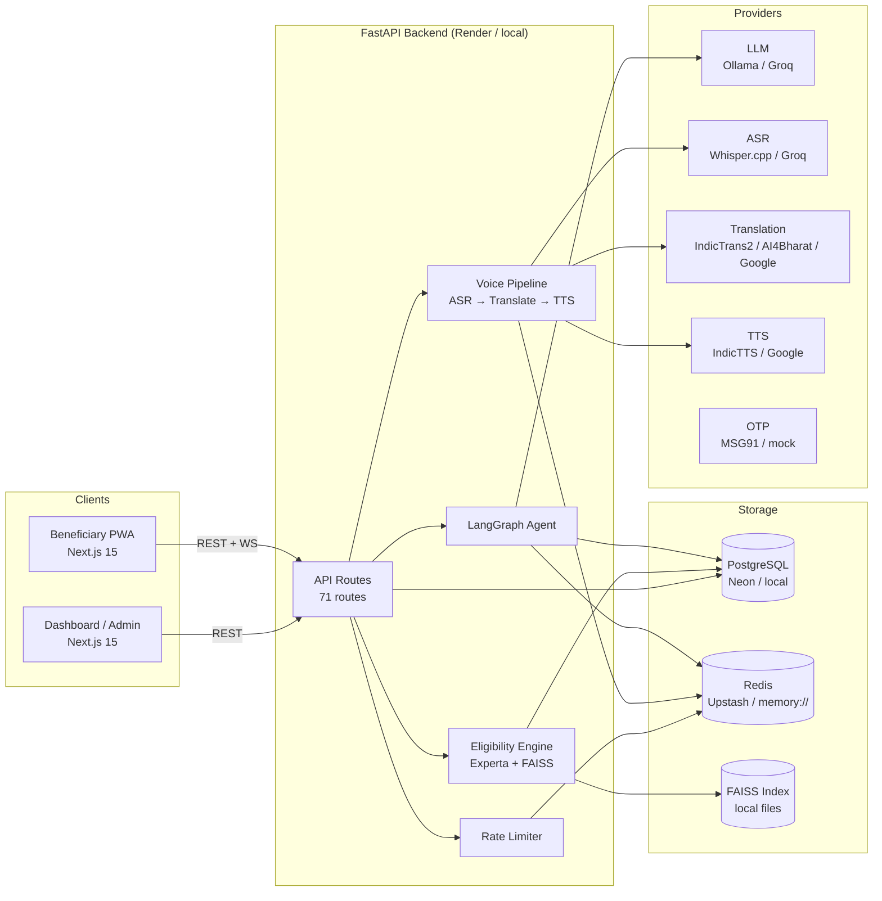
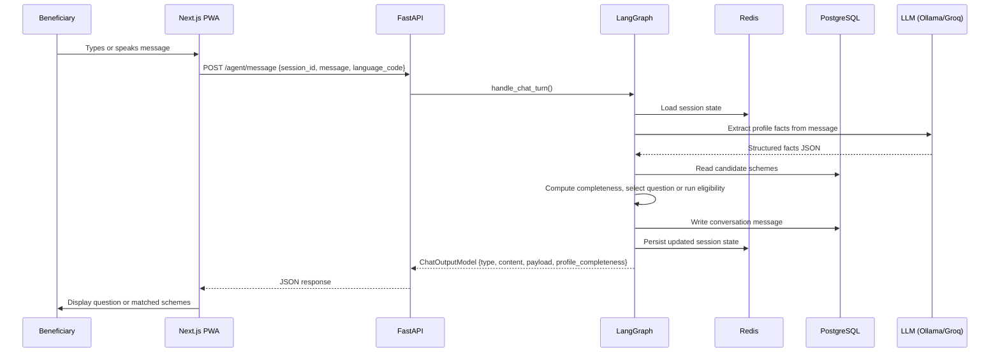
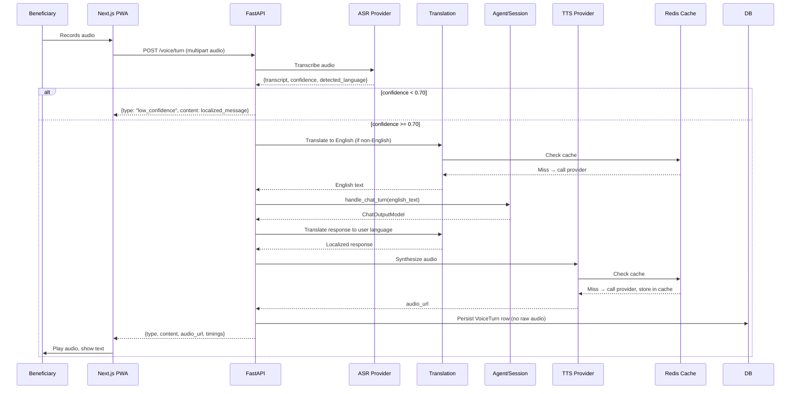
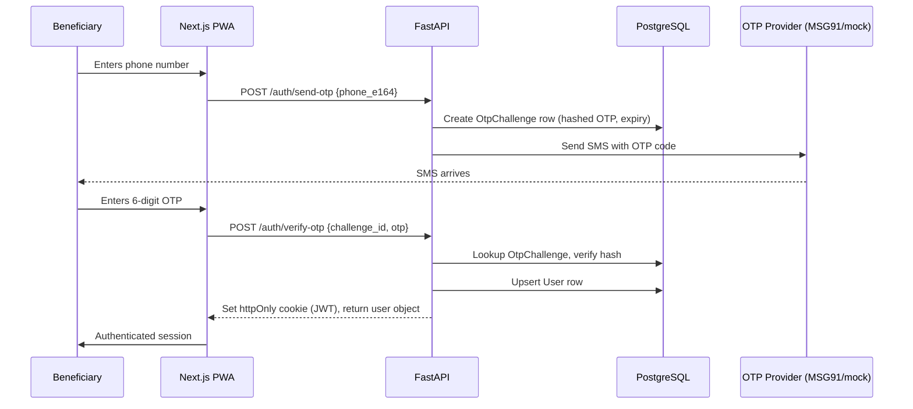

# Architecture

## System Overview

AdhikarAI is a two-tier web application with a Next.js PWA frontend, a FastAPI async backend, and a set of interchangeable AI/ML providers.



---

## Component Descriptions

| Component | Technology | Responsibility |
|---|---|---|
| Beneficiary PWA | Next.js 15, App Router, TypeScript | Voice-first UI, offline support, OTP login |
| Dashboard / Admin | Next.js 15 (same app, separate routes) | Operator and admin management UI |
| FastAPI Backend | FastAPI, Python 3.11+, asyncpg | All API routes, auth, business logic |
| LangGraph Agent | LangGraph 0.2+, LangChain | Conversation graph, question selection, eligibility result formatting |
| Eligibility Engine | Experta 1.9, custom criteria | Rule evaluation, near-miss, cross-exclusion checking |
| FAISS Index | faiss-cpu, multilingual-e5-small | Semantic scheme search |
| Voice Pipeline | Custom orchestrator | ASR → translate to English → agent → translate back → TTS |
| PostgreSQL | SQLAlchemy async, asyncpg | All persistent data |
| Redis | redis-py async | Session state, translation/TTS cache, rate limit counters |
| APScheduler | APScheduler 3.10 | Scheme expiry checks, quality monitoring |

---

## Frontend Structure

```
frontend/app/
  page.tsx              ← Main beneficiary PWA (/)
  layout.tsx            ← Root layout, PWA meta
  styles.css            ← Global design system
  dev-chat/             ← Developer agent test UI (/dev-chat)
  dev-voice/            ← Developer voice test UI (/dev-voice)
  dashboard/            ← Operator dashboard (/dashboard/*)
  admin/                ← Admin panel (/admin/*)

frontend/components/
  dashboard/            ← Dashboard shell, beneficiary cards, forms
  dev-chat/             ← Chat window for dev UI
  pwa/                  ← Install prompt, offline notice
  voice/                ← Audio recorder, waveform, language selector

frontend/lib/
  api.ts                ← Typed API client functions
  offlineDb.ts          ← IndexedDB schema and helpers
```

---

## Backend Module Structure

```
backend/app/
  main.py               ← FastAPI app factory, middleware, router registration
  core/
    config.py           ← Pydantic Settings class (all env vars)
    security.py         ← JWT creation/decode, OTP hash, cookie helpers, auth deps
    errors.py           ← ApiError dataclass, error response formatter
  api/routes/           ← All FastAPI routers (18 files)
  agent/                ← LangGraph graph, state, extraction, completeness, question selection
  voice/                ← VoicePipeline orchestrator, ASR providers, localized messages
  translation/          ← Translation client, language detection, providers
  tts/                  ← TTS client, cache, providers
  services/
    eligibility/        ← Criteria evaluator, matcher, near-miss, validation
    sessions/           ← Redis session store, session service (chat turn handler)
    schemes.py          ← Scheme CRUD helpers
    profiles.py         ← Profile CRUD helpers
    households.py       ← Household helpers
    phase4.py           ← Phase 4 service logic (OTP, saved schemes, checklist, etc.)
    search/             ← FAISS indexing and embedding helpers
    documents/          ← Document matcher and substitute guidance
    jobs/               ← APScheduler builder and expiry checker
    seeds.py            ← Seed data loader
  dashboard/            ← Dashboard service helpers, RBAC, bulk eligibility
  admin_panel/          ← Scheme drafts, queries, quality flags, analytics
  db/
    models/             ← SQLAlchemy ORM models (17 model files)
    migrations/         ← Alembic migration scripts (5 phases)
    session.py          ← Async session factory and get_db dependency
    base.py             ← DeclarativeBase
  schemas/              ← Pydantic request/response models (15 schema files)
  rate_limit/           ← Redis-backed daily counter service
  cli/                  ← Typer CLI (admin commands + local E2E seed helper)
  seeds/                ← JSON seed files (central_schemes.v1.json)
```

---

## Request Flow — Beneficiary Agent Turn



---

## Request Flow — Voice Turn



---

## Auth Flow



---

## Local vs Staging Deployment Shape

| Aspect | Local | Staging / Production |
|---|---|---|
| Database | Local PostgreSQL (trust auth or user-owned data dir) | Neon (Serverless PostgreSQL) |
| Redis | `memory://` in-process fallback | Upstash Redis (`rediss://`) |
| LLM | Ollama local (`llama3.1:8b`) | Groq API (`llama-3.3-70b-versatile`) |
| ASR | Whisper.cpp local binary | Groq Whisper API |
| Translation | IndicTrans2 local HTTP service | AI4Bharat hosted API |
| TTS | IndicTTS-compatible local HTTP service | Google Cloud TTS |
| OTP | Mock (OTP logged, not sent) | MSG91 SMS |
| Dashboard auth | Dev code-based (`DASHBOARD_DEV_LOGIN_ENABLED=true`) | Disabled (no real SSO yet) |
| Cookie security | `AUTH_COOKIE_SECURE=false` (HTTP local) | `AUTH_COOKIE_SECURE=true` (HTTPS) |
| CORS | `http://localhost:3000` | Vercel deployment URL |
| Frontend | `npm run dev` | `vercel deploy` |
| Backend | `uvicorn app.main:app` | Render web service |

---

## Provider Interfaces

All AI/ML providers implement a common interface so local and hosted environments return the same internal data shapes:

- **ASR**: `ASRProvider.transcribe(audio, mime_type, lang)` → `AsrResponseModel`
- **Translation**: `TranslationClient.translate(request, db, org_id, session_id)` → `TranslateResponseModel`
- **TTS**: `TtsClient.synthesize_to_url(request, db, org_id, session_id)` → `TtsResponseModel`

Providers are selected at startup from environment variables and injected into pipelines via factory functions.
