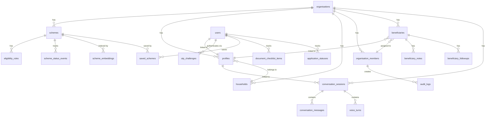

# Data Model Diagram

Core database relationship overview for AdhikarAI.

---

## Entity Relationship Overview

---

## Core Tables and Relationships

```mermaid
flowchart TB
    subgraph Tenancy
        Org[organisations<br/>id, name, slug]
    end

    subgraph Schemes["Scheme Layer"]
        S[schemes<br/>id TEXT PK, name, status, benefit]
        ER[eligibility_rules<br/>rule_json JSONB]
        SE[scheme_embeddings<br/>embedding_json JSONB]
        SSE[scheme_status_events<br/>old_status → new_status]
        SD[scheme_drafts<br/>payload JSONB, status]
    end

    subgraph Profiles["Profile Layer"]
        P[profiles<br/>age, gender, caste, income, state]
        H[households<br/>family_income, ration_card_type]
    end

    subgraph Auth["Auth Layer"]
        U[users<br/>phone_e164, profile_id]
        OC[otp_challenges<br/>otp_hash, attempts, expires_at]
    end

    subgraph Conversation["Conversation Layer"]
        CS[conversation_sessions<br/>language_code, questions_asked]
        CM[conversation_messages<br/>role, content, metadata]
        VT[voice_turns<br/>asr_confidence, durations]
    end

    subgraph Dashboard["Dashboard Layer"]
        OM[organisation_members<br/>role, email, is_active]
        B[beneficiaries<br/>assigned_operator_id, status]
        BN[beneficiary_notes<br/>content, created_by]
        BF[beneficiary_followups<br/>due_date, status]
        AL[audit_logs<br/>action, resource_type]
    end

    subgraph UserData["User Data Layer"]
        SS[saved_schemes<br/>user_id, scheme_id]
        DCI[document_checklist_items<br/>is_collected]
        AS[application_statuses<br/>status, scheme_id]
    end

    Org --> S
    Org --> P
    Org --> OM
    Org --> B
    S --> ER
    S --> SE
    S --> SSE
    P --> H
    U --> P
    U --> OC
    CS --> P
    CS --> CM
    CS --> VT
    B --> P
    B --> OM
    B --> BN
    B --> BF
    OM --> AL
    U --> SS
    U --> DCI
    U --> AS
```

---

## Table Groups

### Phase 1 — Foundation

| Table | Purpose | Tenancy |
|---|---|---|
| `organisations` | Top-level tenant | N/A |
| `admin_users` | Admin accounts | Global |
| `scheme_categories` | Scheme groupings | Per-org |
| `schemes` | Government welfare schemes | Per-org |
| `eligibility_rules` | JSONB-based eligibility criteria | Per-org |
| `scheme_versions` | Scheme version tracking | Per-org |
| `scheme_status_events` | Status change audit trail | Per-org |
| `faiss_indexes` | FAISS index metadata | Per-org |
| `scheme_embeddings` | Embedding vectors for semantic search | Per-org |
| `profiles` | Beneficiary demographic data | Per-org |
| `households` | Family group data | Per-org |
| `profile_events` | Profile change events | Per-org |
| `document_check_events` | Document check tracking | Per-org |
| `zero_match_events` | Zero-match tracking | Per-org |
| `admin_notifications` | Admin notification queue | Per-org |
| `ingestion_runs` | Data ingestion tracking | Per-org |
| `ingestion_payloads` | Ingestion payload data | Per-org |

### Phase 2 — Conversation

| Table | Purpose | Tenancy |
|---|---|---|
| `conversation_sessions` | Agent conversation sessions | Per-org |
| `conversation_messages` | Message history | Per-session |

### Phase 3 — Voice

| Table | Purpose | Tenancy |
|---|---|---|
| `voice_turns` | Voice pipeline metrics (no raw audio) | Per-org |
| `translation_events` | Translation call tracking | Per-org |
| `tts_events` | TTS call tracking | Per-org |

### Phase 4 — User PWA

| Table | Purpose | Tenancy |
|---|---|---|
| `users` | Authenticated beneficiaries | Per-org |
| `otp_challenges` | OTP verification state | Global |
| `saved_schemes` | User's saved schemes | Per-user |
| `document_checklist_items` | Document collection tracking | Per-user |
| `application_statuses` | Application progress tracking | Per-user |
| `application_status_events` | Status change history | Per-status |
| `action_plans` | Scheme action plans | Per-user |
| `notification_subscriptions` | Push notification endpoints | Per-user |
| `notification_jobs` | Push notification queue | Per-user |
| `offline_sync_events` | Offline sync tracking | Per-user |
| `digilocker_connections` | DigiLocker OAuth state | Per-user |
| `verified_documents` | Document verification metadata | Per-user |
| `user_language_preferences` | Language preference history | Per-user |

### Phase 5 — Dashboard

| Table | Purpose | Tenancy |
|---|---|---|
| `organisation_members` | Staff users (operators, admins) | Per-org |
| `beneficiaries` | Dashboard-managed beneficiary records | Per-org |
| `beneficiary_notes` | Operator notes | Per-beneficiary |
| `beneficiary_followups` | Follow-up tasks | Per-beneficiary |
| `beneficiary_scheme_assignments` | Scheme assignments | Per-beneficiary |
| `bulk_eligibility_jobs` | Bulk CSV job tracking | Per-org |
| `bulk_eligibility_rows` | Individual CSV rows | Per-job |
| `audit_logs` | Dashboard write audit trail | Per-org |
| `scheme_drafts` | Scheme editing workflow | Per-org |
| `scheme_audit_logs` | Scheme publish audit | Per-org |
| `unmatched_queries` | Zero-match query tracking | Per-org |
| `quality_flags` | Data quality issues | Per-org |
| `operator_notifications` | Operator notification queue | Per-member |
| `rate_limit_events` | Rate limit tracking | Per-org |
