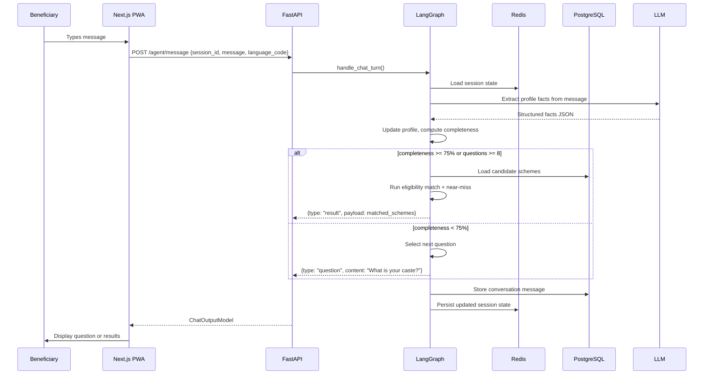
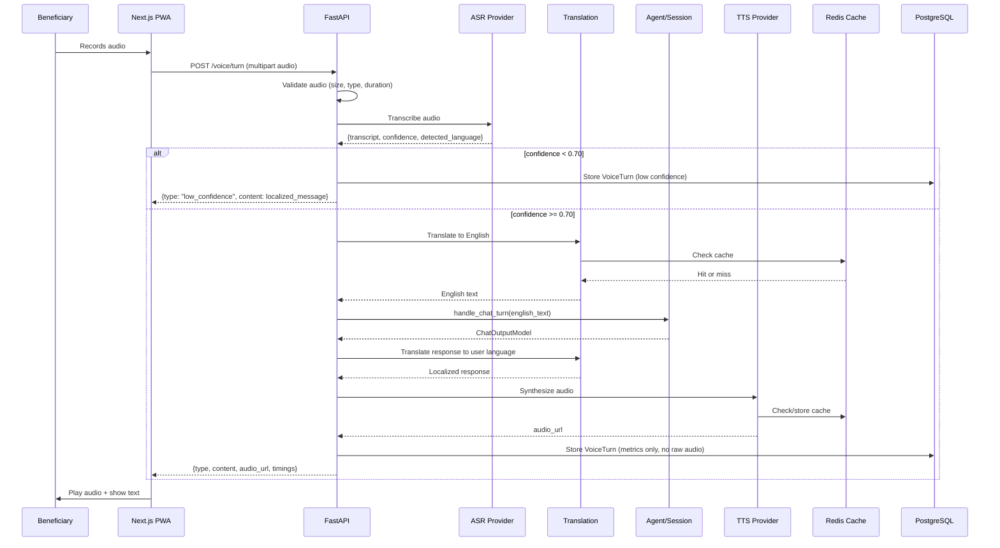
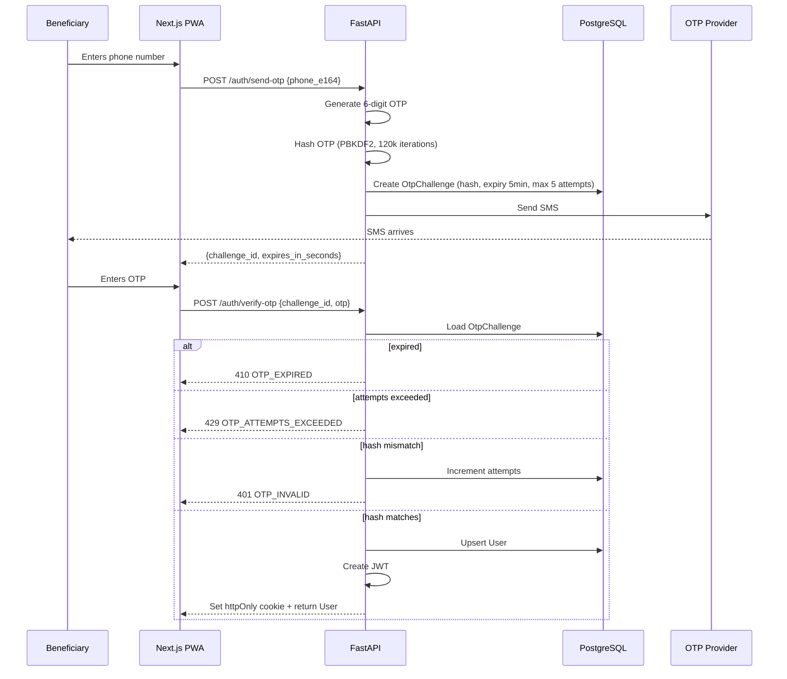
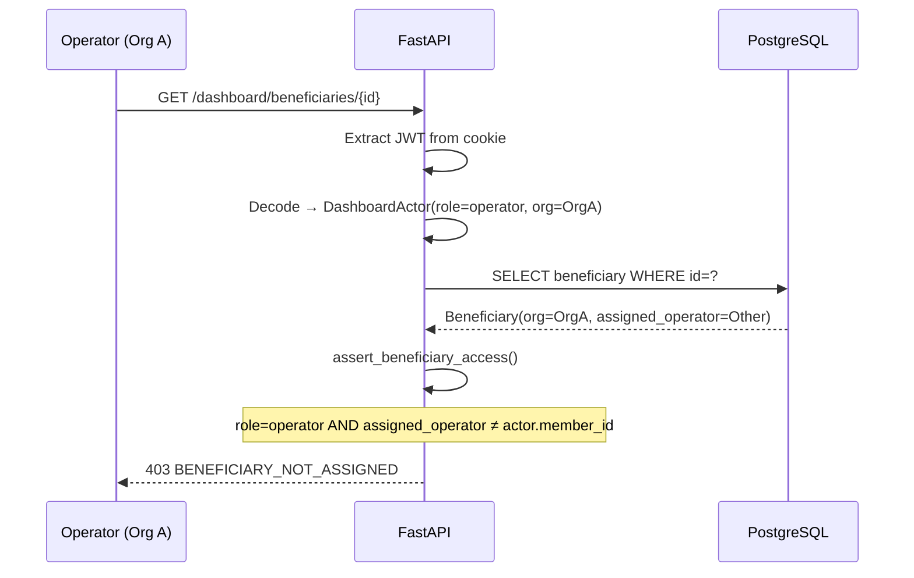
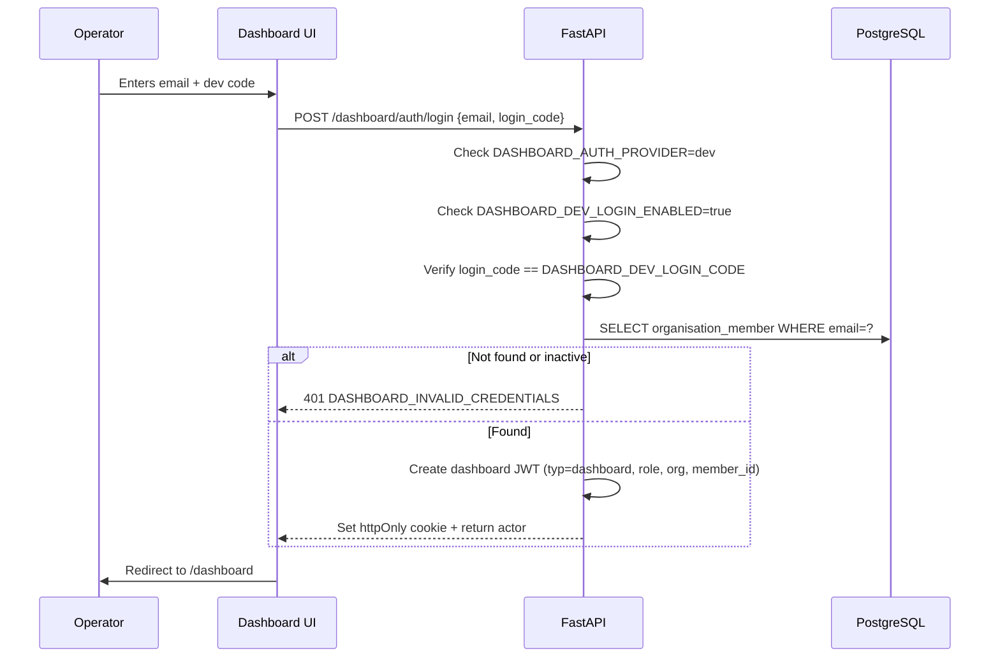
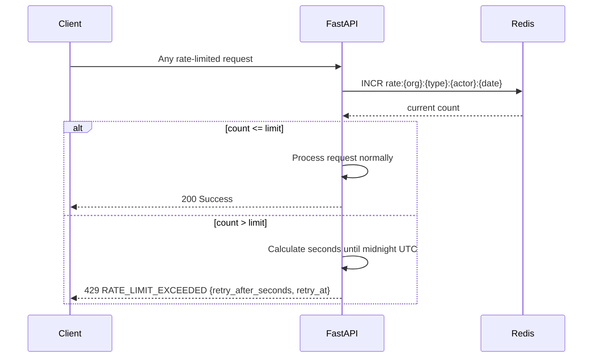
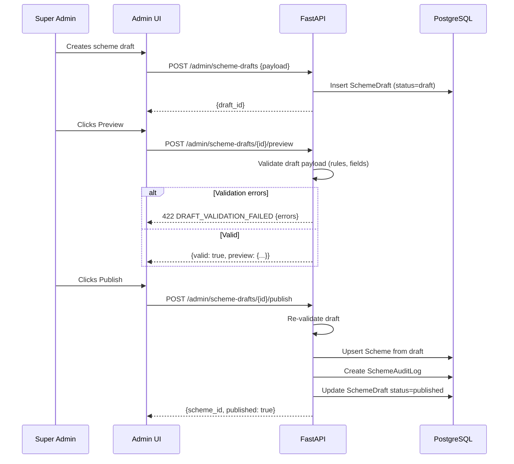

# Request Flow Diagrams

Key request flows through the AdhikarAI system.

---

## Beneficiary Agent Turn (Text)

---

## Voice Turn (Full Pipeline)

---

## OTP Authentication

---

## Dashboard RBAC Enforcement

---

## Dashboard Login (Dev Mode)

---

## Rate Limiting

---

## Scheme Draft → Publish

