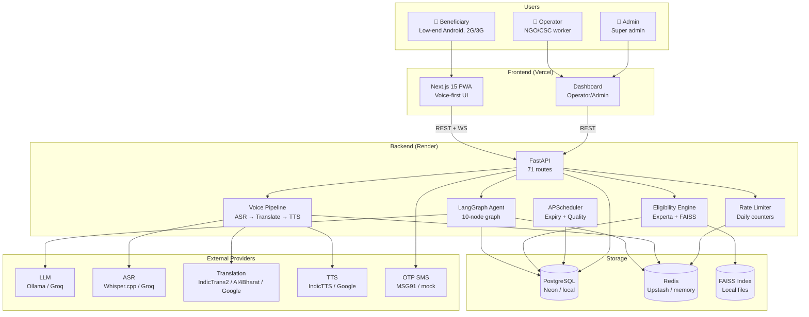
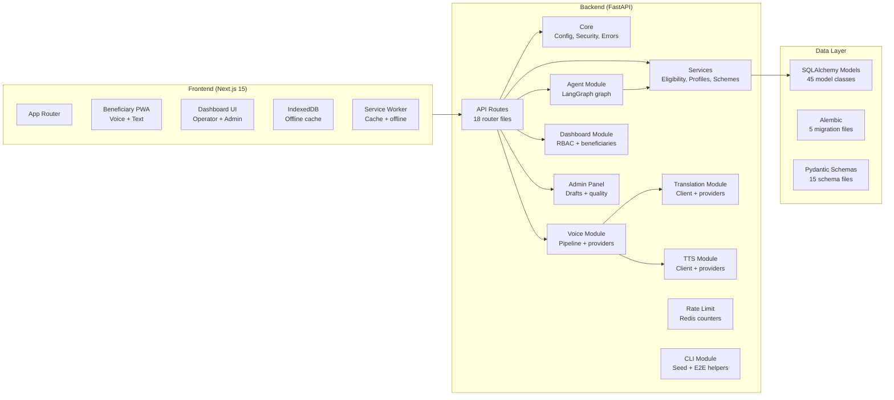
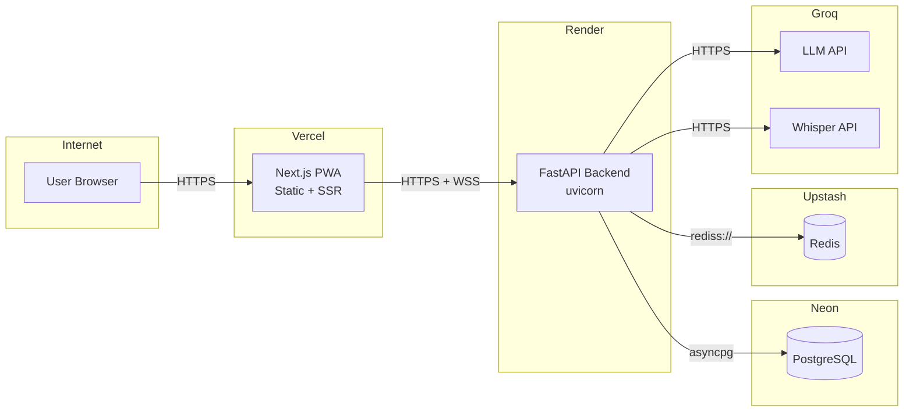

# System Context Diagram

High-level system context showing AdhikarAI's components and their relationships.

---

## System Architecture

---

## Component Architecture

---

## Deployment Topology

