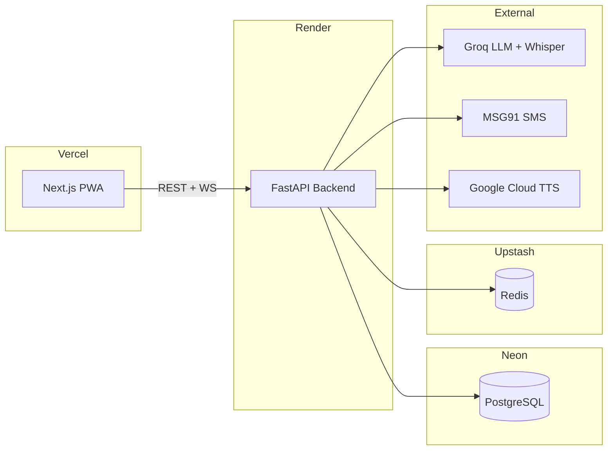

# Deployment Readiness

Current deployment status: **Not production-ready end-to-end**. The backend builds, all 55 tests pass, and the frontend builds. Staging deployment requires configuration described below. Production deployment has additional hard requirements.

---

## Deployment Architecture



---

## Staging Configuration Checklist

### Backend Environment (Required)

| Variable | Requirement |
|---|---|
| `APP_ENV` | `staging` |
| `AUTH_JWT_SECRET` | Non-default, ≥ 32 characters |
| `AUTH_COOKIE_SECURE` | `true` |
| `AUTH_COOKIE_SAMESITE` | `none` for cross-site Vercel→Render, else `lax` |
| `AUTH_COOKIE_DOMAIN` | Set only if using a shared custom parent domain |
| `DATABASE_URL` | Neon PostgreSQL URL (not localhost) |
| `DATABASE_DIRECT_URL` | Neon direct connection URL |
| `REDIS_URL` | `rediss://` Upstash URL |
| `ADMIN_API_TOKEN` | Non-default |
| `CORS_ORIGINS` | Explicit Vercel deployment URL(s) |
| `DASHBOARD_AUTH_PROVIDER` | `disabled` (no real staff auth yet) |
| `DASHBOARD_DEV_LOGIN_ENABLED` | `false` |
| `LOCAL_E2E_HELPERS_ENABLED` | `false` |

### Backend Environment (Provider-Dependent)

| Variable | When Required |
|---|---|
| `GROQ_API_KEY` | When `LLM_PROVIDER=groq` or `VOICE_PROVIDER=groq` |
| `AI4BHARAT_TRANSLATE_URL` + `AI4BHARAT_API_KEY` | When `TRANSLATION_PROVIDER=ai4bharat_hosted` |
| `GOOGLE_TRANSLATE_API_KEY` | When `TRANSLATION_PROVIDER=google` |
| `GOOGLE_APPLICATION_CREDENTIALS` | When `TTS_PROVIDER=google` |
| `MSG91_AUTH_KEY` + `MSG91_TEMPLATE_ID` | When `OTP_PROVIDER=msg91` |

### Frontend Environment

| Variable | Requirement |
|---|---|
| `NEXT_PUBLIC_API_BASE_URL` | Render backend URL |
| `NEXT_PUBLIC_ENABLE_DEV_TOOLS` | `false` |

---

## Production Additional Requirements

All staging requirements plus:

| Constraint | Enforcement |
|---|---|
| `OTP_PROVIDER` cannot be `mock` | Config validator raises at startup |
| `CORS_ORIGINS` cannot include `localhost` | Config validator raises at startup |
| `STORE_AUDIO_DEBUG` must be `false` | Config validator raises at startup |
| Dashboard dev login must be disabled | Config validator raises at startup |

---

## Startup Validation

The `Settings.model_validator` in `app/core/config.py` enforces all of the above constraints. If any constraint is violated when `APP_ENV` is `staging` or `production`, the application **refuses to start** with a descriptive error message.

This is a fail-closed design — no insecure default can accidentally reach deployment.

---

## What Is Not Yet Ready for Production

| Area | Gap |
|---|---|
| Real SMS OTP delivery | MSG91 integration wired but not tested with real SMS |
| Dashboard staff auth | Only dev code login exists; no real identity provider (SSO/SAML) |
| Voice providers | Whisper.cpp/Groq Whisper wired but not smoke-tested |
| Translation/TTS providers | IndicTrans2/AI4Bharat/Google wired but not smoke-tested |
| Async bulk eligibility | Current implementation is synchronous |
| PWA offline sync | Queue exists but automated retry loop not implemented |
| Real Web Push | Subscribe endpoint exists; delivery not implemented |
| Cloud migration | Local PostgreSQL verified; Neon migration not tested |
| CORS/cookie HTTPS | Not validated on real Vercel→Render deployment |
| Admin analytics | Basic counts; not production-grade |
| UptimeRobot keep-warm | Not configured |

---

## Deployment Commands

### Backend (Render)

```bash
# Build
uv sync --extra prod

# Start
uvicorn app.main:app --host 0.0.0.0 --port $PORT

# Migrate
uv run alembic upgrade head
```

### Frontend (Vercel)

```bash
# Build
npm run build

# Vercel auto-deploys from git
```

---

## Health Checks

| Endpoint | Purpose | Response |
|---|---|---|
| `GET /health` | Liveness probe | `{ status: "ok", database: "ok"/"error" }` |
| `GET /readiness` | Readiness probe | `{ ready: true/false, checks: {...} }` |

Configure Render health check to poll `/health`.
