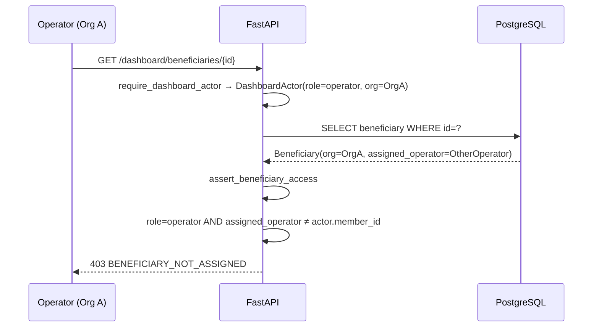

# RBAC and Tenancy

AdhikarAI is a multi-tenant platform. Every stored data item is scoped to an `organisation_id`. Dashboard access is gated by role-based access control (RBAC) enforced on every request.

---

## Tenancy Model

| Entity | Scope |
|---|---|
| `Organisation` | Top-level tenant. Every scheme, beneficiary, and dashboard session belongs to one organisation. |
| `OrganisationMember` | A staff user (operator, NGO admin, or super admin) within an organisation. |
| Public organisation | `00000000-0000-0000-0000-000000000001` — default organisation for public beneficiaries. |

All tenant-scoped tables include `organisation_id UUID NOT NULL REFERENCES organisations(id)`. All queries filter by `organisation_id`.

---

## Roles

| Role | Access Scope |
|---|---|
| `operator` | Only assigned beneficiaries within their organisation |
| `ngo_admin` | All beneficiaries within their organisation |
| `super_admin` | All organisations — full platform access |

---

## Permissions

**File**: `app/dashboard/rbac.py`

Permissions are defined as constants and checked via `require_actor_permission(actor, permission)`:

| Permission | Operator | NGO Admin | Super Admin |
|---|---|---|---|
| `beneficiary.create` | ✅ | ✅ | ✅ |
| `beneficiary.read` | Assigned only | ✅ (org) | ✅ (all) |
| `beneficiary.update` | Assigned only | ✅ (org) | ✅ (all) |
| `beneficiary.note.create` | ✅ | ✅ | ✅ |
| `beneficiary.followup.create` | ✅ | ✅ | ✅ |
| `beneficiary.eligibility.run` | ✅ | ✅ | ✅ |
| `bulk_eligibility.upload` | ✅ | ✅ | ✅ |
| `export.beneficiaries` | ❌ | ✅ | ✅ |
| `analytics.read` | ❌ | ✅ | ✅ |
| `scheme.draft.create` | ❌ | ❌ | ✅ |
| `scheme.publish` | ❌ | ❌ | ✅ |
| `quality_flag.review` | ❌ | ❌ | ✅ |
| `unmatched_queries.read` | ❌ | ❌ | ✅ |
| `operator_management` | ❌ | ✅ | ✅ |
| `org_management` | ❌ | ❌ | ✅ |

---

## DashboardActor Dataclass

```python
@dataclass
class DashboardActor:
    user_id: UUID
    member_id: UUID
    organisation_id: UUID
    role: str  # "operator" | "ngo_admin" | "super_admin"
    display_name: str
    permissions: list[str]
```

All dashboard routes receive a `DashboardActor` via `Depends(require_dashboard_actor)`.

---

## Access Control Functions

### `assert_beneficiary_access(actor, beneficiary_org_id, assigned_operator_id)`

Called by all beneficiary detail/update routes:

```python
if actor.role == "super_admin":
    return  # always allowed

if actor.organisation_id != beneficiary_org_id:
    raise ApiError(403, "ORG_SCOPE_DENIED")

if actor.role == "operator" and actor.member_id != assigned_operator_id:
    raise ApiError(403, "BENEFICIARY_NOT_ASSIGNED")
```

### `assert_organisation_scope(actor, resource_org_id)`

Called for organisation-scoped resources:

```python
if actor.role == "super_admin":
    return
if actor.organisation_id != resource_org_id:
    raise ApiError(403, "ORG_SCOPE_DENIED")
```

### `require_actor_permission(actor, permission)`

```python
if permission not in actor.permissions:
    raise ApiError(403, "PERMISSION_DENIED")
```

---

## Sequence Diagram — RBAC Enforcement



---

## JWT Structure (Dashboard)

```json
{
  "sub": "<user_id>",
  "member_id": "<member_id>",
  "org": "<organisation_id>",
  "role": "operator",
  "typ": "dashboard",
  "iat": 1716800000,
  "exp": 1716803600
}
```

The `typ: "dashboard"` field distinguishes dashboard JWTs from beneficiary JWTs.

---

## Multi-Tenancy Rules

Per `AGENTS.md`:

- Every tenant-scoped table must include `organisation_id`.
- Every tenant-scoped query must filter by `organisation_id`.
- Never trust `organisation_id` from a request body when an authenticated actor exists — always use `actor.organisation_id` from the JWT.
- Operators can access only assigned beneficiaries.
- NGO admins can access only their organisation.
- Super admins can access all organisations.

---

## Tests

| Test | Coverage |
|---|---|
| `tests/unit/test_phase5_rbac.py` | Operator denial, NGO admin org scope, super admin override |
| `tests/unit/test_dashboard_auth.py` | JWT validation, `require_dashboard_actor` |
| `frontend/tests/e2e/operator-dashboard.spec.ts` | Operator login and beneficiary access E2E |
| `frontend/tests/e2e/ngo-admin.spec.ts` | NGO admin login and org-scoped access E2E |
| `frontend/tests/e2e/super-admin.spec.ts` | Super admin cross-org access E2E |
