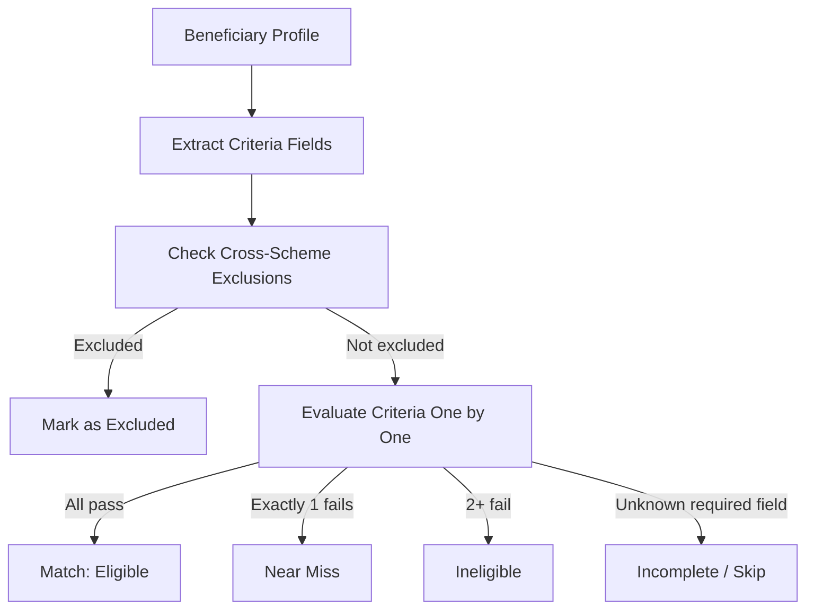

# Scheme Eligibility

AdhikarAI's eligibility engine matches a beneficiary's profile against government scheme rules stored in PostgreSQL JSONB format.

---

## Design Principles

- **Data-driven**: Eligibility rules live in the database (`eligibility_rules.rule_json`), not in application code. Adding or changing rules does not require a code deployment.
- **Experta-backed**: The primary evaluator uses [Experta](https://experta.readthedocs.io/) (a Python expert-system library) to evaluate complex rule logic.
- **Near-miss awareness**: If a beneficiary fails exactly one rule criterion, the scheme is flagged as a "near miss" to guide them toward eligibility.
- **Cross-scheme exclusions**: Rules can mark schemes as mutually exclusive (e.g., can't receive two housing schemes simultaneously).
- **Incomplete schemes**: Schemes with no eligibility rules configured are returned as "incomplete" results, not as matches.

---

## Rule JSONB Format

Each eligibility rule is a `rule_json` JSONB field on the `EligibilityRule` model. The schema is validated using Pydantic schemas in `app/schemas/scheme.py`.

A rule consists of one or more criteria objects:

```json
{
  "criteria": [
    {"field": "age", "op": "gte", "value": 60},
    {"field": "gender", "op": "eq", "value": "female"},
    {"field": "state_code", "op": "in", "value": ["OD", "WB", "AS"]},
    {"field": "bpl_card", "op": "eq", "value": true}
  ],
  "exclusions": ["scheme-id-A", "scheme-id-B"],
  "documents": [
    {
      "name": "Aadhaar Card",
      "substitutes": ["Voter ID", "Ration Card"],
      "required": true
    }
  ]
}
```

Supported operators: `eq`, `neq`, `gte`, `lte`, `gt`, `lt`, `in`, `nin`.

Supported fields: profile fields such as `age`, `gender`, `state_code`, `caste`, `bpl_card`, `disability`, `marital_status`, `annual_income_inr`, `land_hectares`, `occupation`, `education_level`, and household fields.

---

## Evaluation Flow



---

## Matching Algorithm

**File**: `app/services/eligibility/matcher.py`

1. Load all `published` schemes for the organisation.
2. For each scheme, load its eligibility rules.
3. For each rule, evaluate each criterion against the profile.
4. Apply cross-scheme exclusion logic.
5. Classify:
   - **Eligible**: All criteria pass.
   - **Near miss**: Exactly one criterion fails, none are unknown.
   - **Ineligible**: Two or more criteria fail.
   - **Incomplete**: Any required criterion field is unknown in the profile.
6. Return ranked lists of `matched_schemes` and `near_miss_schemes`.

---

## Criteria Evaluator

**File**: `app/services/eligibility/criteria.py`

The criteria evaluator supports custom criteria types beyond simple field comparison:
- `age` — calculated from `date_of_birth` or `age` field
- `bpl_card` — boolean check
- `disability` — boolean or severity-level check
- `income_band` — range check on `annual_income_inr`
- `state_code` — `in`/`nin` list check
- `caste` — enum list check
- `gender` — exact match
- `land_hectares` — range check

---

## FAISS Semantic Search

**File**: `app/services/search/faiss_index.py`

In addition to rule-based matching, AdhikarAI supports semantic search over scheme names and descriptions:

- Schemes are embedded using `intfloat/multilingual-e5-small` (via `sentence-transformers`).
- Embeddings are indexed in a FAISS `IndexFlatL2` index.
- Index files are stored at `FAISS_INDEX_DIR` (default `./data/faiss`).
- `GET /schemes/search?q=...&organisation_id=...` returns nearest-neighbour matches.
- The FAISS index is rebuilt by the `adhikarai-admin rebuild-index` CLI command.

> **Note**: The FAISS index is not auto-built on startup. Run `adhikarai-admin rebuild-index` after seeding or importing schemes.

---

## Profile Match API

**Route**: `POST /profile/match`

Accepts a profile JSON payload and returns:

```json
{
  "matched_schemes": [...],
  "near_miss_schemes": [...],
  "incomplete_schemes": [...],
  "profile_completeness": 72
}
```

This endpoint is called by the agent after collecting enough profile information. It is also callable directly for integration testing.

---

## Near-Miss Logic

A near-miss scheme is one where the beneficiary fails exactly one eligibility criterion. The API response for a near-miss scheme includes:

- `failed_criterion`: the field and expected value that failed
- `failed_reason`: human-readable explanation
- `substitute_guidance`: if the failed criterion is a document, what substitutes are accepted

This enables the app to tell the beneficiary: "You almost qualify for this scheme. If you can get a BPL card, you would be eligible."

---

## Document Substitute Guidance

**File**: `app/services/documents/document_matcher.py`

Each scheme's document checklist includes a list of required documents with optional substitute documents. The document check API (`GET /document-check`) returns:

- Primary document names
- Accepted substitute documents for each primary document
- Notes about document equivalency

This is particularly important for rural beneficiaries who may not have standard documents like Aadhaar but may have equivalent state-issued identity documents.

---

## Scheme Lifecycle

| Status | Description |
|---|---|
| `draft` | New scheme being configured; not visible to beneficiaries |
| `published` | Active scheme; included in eligibility matching |
| `archived` | No longer active; excluded from matching |
| `expiring_soon` | Published but within `SCHEME_EXPIRY_WARNING_DAYS` of end date |

Status transitions are recorded in `scheme_status_events`.

---

## Tests

| Test file | Coverage |
|---|---|
| `tests/unit/test_near_miss.py` | Near-miss detection logic |
| `tests/unit/test_criteria_evaluator.py` | Individual criterion evaluation |
| `tests/unit/test_rule_validation.py` | Eligibility rule JSONB schema validation |
| `tests/unit/test_seed_data.py` | Seed scheme structure |
| `tests/integration/test_profile_match_api.py` | `/profile/match` endpoint |
| `tests/integration/test_faiss_search.py` | FAISS search (uses SQLite) |

---

## Known Limitations

- FAISS index must be manually rebuilt after scheme changes. No hot-reload.
- Cross-scheme exclusion is checked against current assignments, not beneficiary history.
- Near-miss logic considers only one failed criterion at a time; multiple near-misses per scheme are not ranked.
- Eligibility rules are evaluated synchronously; large scheme sets (>1000) may add latency.
