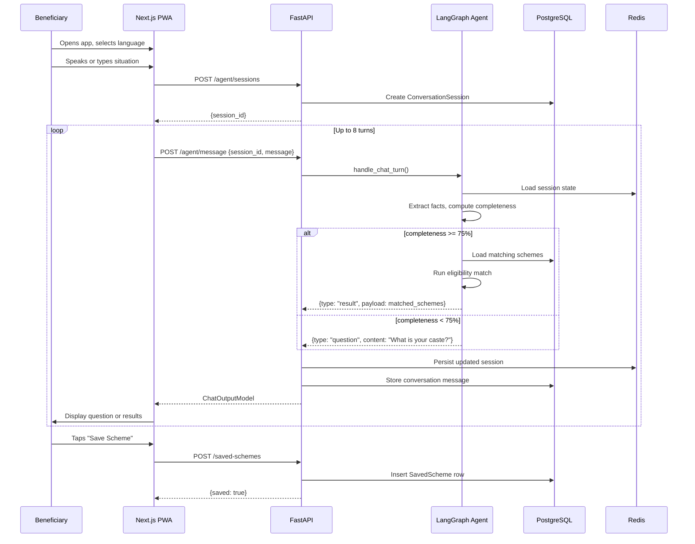

# Beneficiary Journey

The core user journey for a rural beneficiary discovering eligible welfare schemes.

---

## Overview

A beneficiary opens the PWA on their phone, selects their language, and either speaks or types their situation. The agent asks clarifying questions and returns a list of matched government schemes with document checklists and application instructions.

---

## Step-by-Step Narrative

### Step 1 — Open the App

The beneficiary navigates to the PWA URL or launches from the home screen icon. The app loads from cache if offline.

### Step 2 — Select Language

The language selector shows 12+ regional Indian languages. The selection is stored in `localStorage` and sent with every API request.

### Step 3 — Speak or Type

The beneficiary either:
- **Speaks**: Taps the mic button, speaks their situation, taps stop. Audio is uploaded to `/voice/turn`.
- **Types**: Enters a typed message. Sent to `/agent/message`.

The first message is typically a description of their situation:
> "My husband died two years ago. I am 55 years old, I live in Odisha, we have BPL card."

### Step 4 — Agent Asks Clarifying Questions

The agent:
1. Creates a session (`POST /agent/sessions`)
2. Extracts profile facts from the first message
3. Computes which schemes are candidate matches
4. Asks the next most useful question (e.g., "What is your caste category?")

This continues for up to 8 turns.

### Step 5 — Eligibility Matching

When profile completeness reaches ≥ 75%, or after 8 questions, the agent runs eligibility matching and returns:
- Matched schemes with eligibility badges
- Near-miss schemes with the one criterion the beneficiary needs to meet
- Document checklists per scheme

### Step 6 — View Results

The beneficiary sees scheme cards with:
- Scheme name and brief description
- Benefit type (cash/in-kind) and amount
- Eligibility status badge (Eligible / Near Miss)
- Document checklist with substitute options

### Step 7 — Save and Track

The authenticated beneficiary can:
- Save a scheme (`POST /saved-schemes`)
- Mark document checklist items as collected
- Update application status (Not started → Documents collecting → Submitted → Approved)

---

## Sequence Diagram

---

## Frontend Files Involved

- `frontend/app/page.tsx` — Main page with full conversation UI
- `frontend/lib/api.ts` — `createAgentSession()`, `sendAgentMessage()`, `saveScheme()`
- `frontend/lib/offlineDb.ts` — IndexedDB for guest profile and scheme cache
- `frontend/components/voice/AudioRecorder.tsx` — Voice input
- `frontend/components/voice/LanguageSelector.tsx` — Language picker

---

## Backend Routes Involved

| Route | Purpose |
|---|---|
| `POST /agent/sessions` | Create conversation session |
| `POST /agent/message` | Send typed message |
| `POST /voice/turn` | Send voice turn (full pipeline) |
| `GET /schemes/{id}` | Fetch scheme detail for result cards |
| `POST /saved-schemes` | Save a matched scheme |
| `PATCH /checklists` | Update document checklist |
| `PATCH /application-status` | Update application status |

---

## Data Written

| Model | When |
|---|---|
| `ConversationSession` | On session create |
| `ConversationMessage` | Per agent turn |
| `Profile` (guest) | Upserted per session if profile updates |
| `VoiceTurn` | Per voice turn (no raw audio) |
| `SavedScheme` | When beneficiary saves a scheme |
| `DocumentChecklistItem` | When beneficiary checks/unchecks a document |
| `ApplicationStatus` | When beneficiary updates status |

---

## Error Paths

| Scenario | Behaviour |
|---|---|
| Network offline | PWA serves from cache; text queued to sync queue |
| Low ASR confidence | Agent not called; localized retry message returned |
| Agent timeout | `ApiError(504, "AGENT_TIMEOUT")` returned; user sees error message |
| Rate limit exceeded | `ApiError(429, "RATE_LIMIT_EXCEEDED")` with `retry_after_seconds` |
| No schemes matched | Result shows empty matched list; agent suggests visiting a CSC |

---

## Tests

| Test | Coverage |
|---|---|
| `tests/unit/test_near_miss.py` | Eligibility matching result |
| `tests/integration/test_phase2_agent_routes.py` | Session create + message send |
| `tests/unit/test_phase3_voice_pipeline.py` | Voice turn including low-confidence path |
| `frontend/tests/e2e/beneficiary-pwa.spec.ts` | Full E2E: typed flow, scheme display, no JWT in localStorage |
