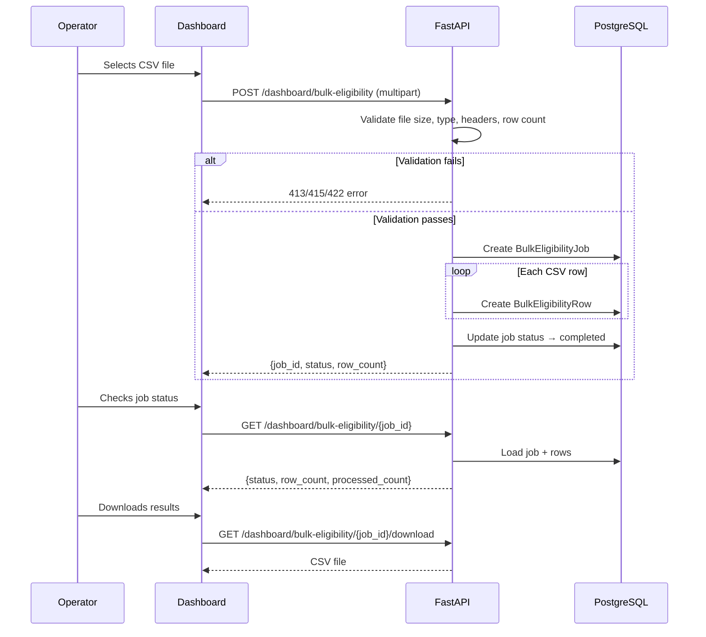

# Bulk Eligibility Workflow

Operators can upload a CSV of beneficiary data to run batch eligibility checks across multiple beneficiaries.

**Status: Partial** — CSV upload and parsing are implemented. Per-row eligibility evaluation is synchronous and returns empty results (no real eligibility run per row).

---

## Overview

An operator uploads a CSV file with beneficiary data. The backend validates the file, creates a `BulkEligibilityJob`, and processes rows synchronously. Results can be downloaded as CSV.

---

## Step-by-Step Narrative

### Step 1 — Upload CSV

The operator navigates to `/dashboard/bulk-eligibility` and uploads a CSV file (max 2 MB, max 500 rows).

### Step 2 — Validate CSV

The backend validates:
- File size ≤ `BULK_ELIGIBILITY_MAX_MB` (default 2 MB)
- Content type is `text/csv`
- Required headers are present
- Row count ≤ `BULK_ELIGIBILITY_MAX_ROWS` (default 500)

### Step 3 — Create Job

A `BulkEligibilityJob` row is created with `status: "processing"`.

### Step 4 — Process Rows

Each CSV row is parsed and stored as a `BulkEligibilityRow`. The current implementation processes synchronously but does not perform real eligibility evaluation per row.

### Step 5 — Download Results

The operator can check job status and download the result CSV.

---

## Sequence Diagram

---

## Frontend Files Involved

- `frontend/app/dashboard/bulk-eligibility/page.tsx` — Upload form and job status

---

## Backend Routes Involved

| Route | Auth | Purpose |
|---|---|---|
| `POST /dashboard/bulk-eligibility` | 📊 Dashboard JWT | Upload CSV |
| `GET /dashboard/bulk-eligibility/{job_id}` | 📊 Dashboard JWT | Get job status |
| `GET /dashboard/bulk-eligibility/{job_id}/download` | 📊 Dashboard JWT | Download result CSV |

---

## Backend Files

| File | Purpose |
|---|---|
| `app/api/routes/dashboard.py` | Route handlers for bulk eligibility endpoints |
| `app/dashboard/bulk_eligibility.py` | CSV validation, row parsing, job creation |

---

## Data Model

| Table | Key Columns |
|---|---|
| `bulk_eligibility_jobs` | `id`, `organisation_id`, `status`, `row_count`, `processed_count`, `created_by` |
| `bulk_eligibility_rows` | `id`, `job_id`, `row_data` (JSONB), `result` (JSONB), `status` |

---

## Validation Errors

| Error Code | HTTP | Cause |
|---|---|---|
| `CSV_TOO_LARGE` | 413 | File exceeds 2 MB |
| `CSV_INVALID_FORMAT` | 415 | Not a valid CSV file |
| `CSV_TOO_MANY_ROWS` | 422 | More than 500 rows |
| `BULK_JOB_NOT_FOUND` | 404 | Job ID not found |

---

## Rate Limiting

Bulk uploads consume rate limit units per row (via `check_operator_limit`). A 500-row upload consumes 500 units from the operator's daily 1,000 limit.

---

## Tests

| Test | Coverage |
|---|---|
| `tests/unit/test_phase5_csv.py` | CSV validation: size, headers, row limit |

---

## Known Limitations

- **No real eligibility evaluation** — rows are parsed but not matched against eligibility rules
- **Synchronous processing** — large CSV uploads block the request; no background job queue
- **No progress tracking** — job status is either `processing` or `completed`
- **No partial failure handling** — if one row fails, behavior is undefined
- Making this production-ready requires: async job queue (e.g., Celery/ARQ), per-row eligibility evaluation, progress events, and partial failure handling
