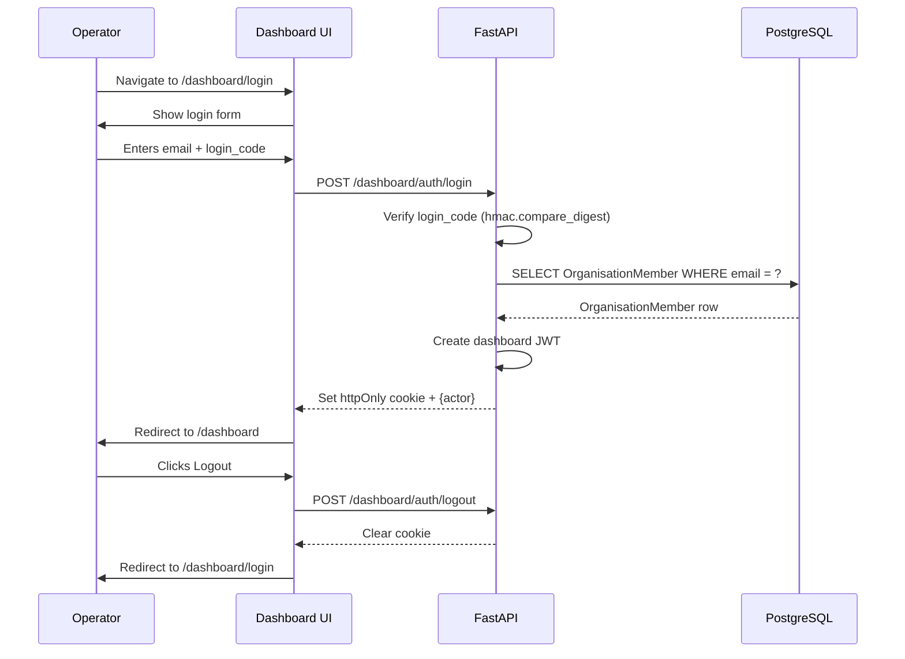

# Dashboard Login and Logout

Authentication for dashboard operators, NGO admins, and super admins.

---

## Current Status: **Local/Dev Only**

Dashboard login currently supports only the dev code-based provider. This is suitable for local development and E2E testing only. In staging and production, `DASHBOARD_AUTH_PROVIDER=disabled` and this endpoint returns `503 DASHBOARD_AUTH_NOT_CONFIGURED`.

A real staff identity provider (SSO/OAuth) must be added before the dashboard is production-ready.

---

## Login Flow (Dev Mode)

### Step 1 — Open Login Page

Operator navigates to `/dashboard/login`.

### Step 2 — Enter Credentials

The login form accepts:
- `email`: The operator's email address (matched against `organisation_members.email`)
- `login_code`: A shared secret code set via `DASHBOARD_DEV_LOGIN_CODE`

### Step 3 — Submit Login

`POST /dashboard/auth/login`

```json
{"email": "operator.local@example.test", "login_code": "local-e2e-login"}
```

The backend:
1. Checks that dev dashboard login is enabled (`_assert_dev_dashboard_login_enabled`).
2. Compares `login_code` to `DASHBOARD_DEV_LOGIN_CODE` using `hmac.compare_digest`.
3. Looks up active `OrganisationMember` rows with matching email.
4. Rejects if zero or more than one match.
5. Creates a dashboard JWT with `{sub, member_id, org, role, typ:"dashboard", iat, exp}`.
6. Sets the JWT as an httpOnly cookie.
7. Returns `{actor: {member_id, organisation_id, role, display_name, permissions}}`.

### Step 4 — Authenticated Dashboard

The cookie is sent automatically with all subsequent dashboard API requests. The `require_dashboard_actor` FastAPI dependency decodes the JWT and returns the `DashboardActor` on every request.

---

## Logout

`POST /dashboard/auth/logout`

Deletes the session cookie by setting `Max-Age=0`. Returns `{logged_out: true}`.

---

## Sequence Diagram



---

## Error Paths

| Scenario | HTTP | Code | Meaning |
|---|---|---|---|
| Auth provider disabled | 503 | `DASHBOARD_AUTH_NOT_CONFIGURED` | Production/staging — login not configured |
| Dev login disabled | 403 | `DASHBOARD_DEV_LOGIN_DISABLED` | Dev login not enabled in env |
| Wrong login_code | 401 | `DASHBOARD_INVALID_CREDENTIALS` | Code mismatch |
| Email not found | 401 | `DASHBOARD_INVALID_CREDENTIALS` | No active member with that email |
| Multiple email matches | 400 | `DASHBOARD_MEMBER_AMBIGUOUS` | More than one active member with email |

---

## Session Checking

Any dashboard route that calls `GET /dashboard/me` will return:
- `200` with actor info if session is valid
- `401 DASHBOARD_SESSION_REQUIRED` if no cookie or expired/invalid JWT

---

## Tests

| Test | Coverage |
|---|---|
| `tests/unit/test_dashboard_auth.py` | Login success, wrong code, disabled provider, logout |
| `frontend/tests/e2e/operator-dashboard.spec.ts` | Login, verify `/dashboard/me`, dashboard access |
