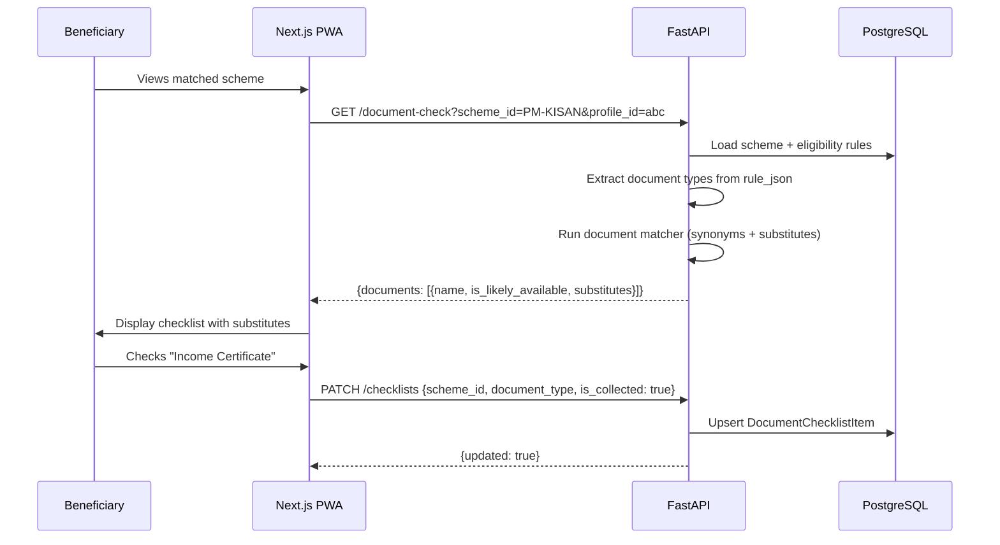

# Document Checklist Workflow

The document checklist helps beneficiaries know which documents they need to apply for a matched scheme, including substitute documents when originals are unavailable.

---

## Overview

After the agent matches eligible schemes, the beneficiary sees a document checklist per scheme. Each document item can be marked as "collected" or "not collected". The checklist also shows substitute documents that can be used instead of missing originals.

---

## Step-by-Step Narrative

### Step 1 — Agent Returns Matched Schemes

The agent completes eligibility matching and returns scheme cards. Each scheme has a set of required documents defined in the `EligibilityRule.rule_json` JSONB field.

### Step 2 — Fetch Document Checklist

The frontend calls `GET /document-check?scheme_id=<id>&profile_id=<id>` to retrieve the document checklist.

The backend:
1. Loads the scheme and its eligibility rules
2. Extracts required document types from rule JSON
3. Runs the document matcher to find synonym matches (e.g., "BPL card" = "Below Poverty Line certificate")
4. Returns substitute guidance for each document type

### Step 3 — Display Checklist

The beneficiary sees a checklist with:
- Document name
- Whether they likely have it (based on profile data)
- Substitute documents (e.g., "If you don't have a BPL card, you can use a Self-Declaration + MLA recommendation letter")

### Step 4 — Mark Documents

Authenticated beneficiaries can check/uncheck items via `PATCH /checklists`:
- Upserts a `DocumentChecklistItem` row
- Stores: `scheme_id`, `document_type`, `is_collected` (boolean)

---

## Sequence Diagram

---

## Frontend Files Involved

- `frontend/app/page.tsx` — Checklist tab in scheme result cards
- `frontend/lib/api.ts` — `getDocumentCheck()`, `updateChecklist()`
- `frontend/lib/offlineDb.ts` — Offline checklist cache

---

## Backend Routes Involved

| Route | Auth | Purpose |
|---|---|---|
| `GET /document-check` | 🔓 Public | Returns document checklist with substitutes |
| `GET /checklists` | 🔐 User JWT | List saved checklist items |
| `PATCH /checklists` | 🔐 User JWT | Upsert checklist item state |

---

## Backend Files

| File | Purpose |
|---|---|
| `app/api/routes/document_check.py` | Route handler |
| `app/services/documents/service.py` | Document matcher, synonym lookup, substitute guidance |
| `app/api/routes/phase4.py` | Checklist CRUD routes |
| `app/services/phase4.py` | Checklist upsert logic |

---

## Data Model

| Table | Key Columns |
|---|---|
| `document_checklist_items` | `user_id`, `scheme_id`, `document_type`, `is_collected`, `updated_at` |
| `document_check_events` | `profile_id`, `scheme_id`, event tracking |

---

## Error Paths

| Scenario | Behaviour |
|---|---|
| Scheme not found | `404 SCHEME_NOT_FOUND` |
| Profile not found | `404 PROFILE_NOT_FOUND` |
| Not authenticated (for PATCH) | `401 NOT_AUTHENTICATED` |
| Offline | Checklist cached in IndexedDB; changes queued to sync |

---

## Tests

| Test | Coverage |
|---|---|
| `tests/unit/test_phase2_document_check.py` | Synonym matching, substitute guidance logic |
| `tests/integration/test_phase4_routes.py` | Checklist CRUD via API |
| `frontend/tests/e2e/beneficiary-pwa.spec.ts` | Checklist UI smoke test |

---

## Known Limitations

- Substitute guidance is rule-based, not AI-generated
- Document availability detection is based on profile fields (heuristic)
- Offline checklist changes are queued but the automated sync retry loop is not yet implemented
