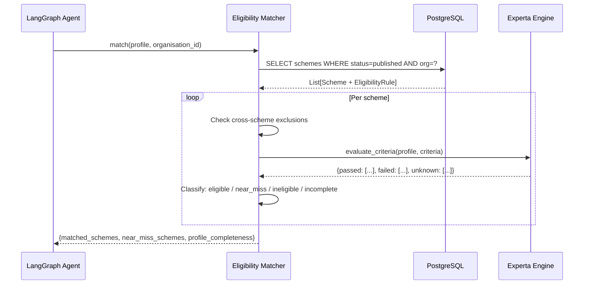

# Eligibility Matching Workflow

How the AdhikarAI eligibility engine matches a beneficiary profile to government welfare schemes.

---

## Trigger Points

Eligibility matching is triggered:
1. **By the agent**: After the profile completeness reaches ≥ 75% or after 8 questions.
2. **Directly**: Via `POST /profile/match` for integration testing or direct use.
3. **Dashboard**: Via `POST /dashboard/beneficiaries/{id}/eligibility` (partial implementation).

---

## Step-by-Step Flow

### Step 1 — Load Candidate Schemes

Load all `published` schemes for the organisation from PostgreSQL. For each scheme, load its `eligibility_rules`.

### Step 2 — Check Cross-Scheme Exclusions

Before evaluating criteria, check if the beneficiary is already assigned to any schemes that exclude the current scheme. If excluded, mark the scheme as `excluded` and skip criteria evaluation.

### Step 3 — Evaluate Each Criterion

For each eligibility rule criterion:
1. Fetch the relevant profile field value.
2. Apply the operator (`eq`, `gte`, `lte`, `in`, `nin`, etc.).
3. If the field is unknown (not yet collected), mark as `unknown`.
4. Record pass/fail/unknown.

### Step 4 — Classify Result

| Result | Condition |
|---|---|
| `eligible` | All criteria pass |
| `near_miss` | Exactly 1 criterion fails, no unknowns among required fields |
| `ineligible` | 2+ criteria fail |
| `incomplete` | Any required criterion field is unknown |

### Step 5 — Return Ranked Results

```json
{
  "matched_schemes": [
    {
      "id": "...",
      "name": "Widow Pension Scheme",
      "benefit_amount_inr": 500,
      "documents": [...],
      "eligibility_confidence": 0.95
    }
  ],
  "near_miss_schemes": [
    {
      "id": "...",
      "name": "BPL Housing Scheme",
      "failed_criterion": {"field": "bpl_card", "op": "eq", "value": true},
      "failed_reason": "You need a BPL card to be eligible"
    }
  ],
  "profile_completeness": 82
}
```

---

## Sequence Diagram



---

## Near-Miss Logic

Near-miss schemes help the beneficiary understand what they need to do to qualify:

```
Given a beneficiary who fails only one criterion:
  - field: bpl_card
  - expected: true
  - actual: false (not collected)

Near-miss response includes:
  - failed_reason: "You need a BPL card"
  - substitute_guidance: "You may use Income Certificate or State BPL List"
```

---

## Document Substitute Guidance

For each required document in a matched or near-miss scheme, the document matcher returns:

```json
{
  "documents": [
    {
      "name": "Aadhaar Card",
      "required": true,
      "substitutes": ["Voter ID", "Ration Card", "Passport"],
      "notes": "Any government-issued photo ID is accepted"
    }
  ]
}
```

---

## Files Involved

| File | Purpose |
|---|---|
| `app/services/eligibility/matcher.py` | Main matching orchestrator |
| `app/services/eligibility/criteria.py` | Individual criterion evaluator |
| `app/services/eligibility/experta_engine.py` | Experta rule engine wrapper |
| `app/services/eligibility/engine.py` | Engine selector |
| `app/services/eligibility/validation.py` | Eligibility rule JSONB validator |
| `app/services/documents/document_matcher.py` | Document substitute guidance |
| `app/api/routes/profile_match.py` | `/profile/match` REST endpoint |

---

## Tests

| Test | Coverage |
|---|---|
| `tests/unit/test_near_miss.py` | Near-miss detection for single-criterion failures |
| `tests/unit/test_criteria_evaluator.py` | Individual operator evaluation |
| `tests/unit/test_rule_validation.py` | JSONB schema validation |
| `tests/integration/test_profile_match_api.py` | Full match API with SQLite test DB |
