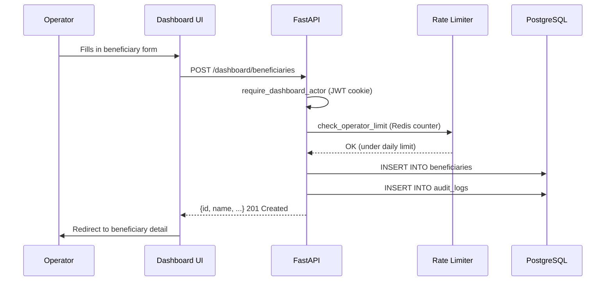
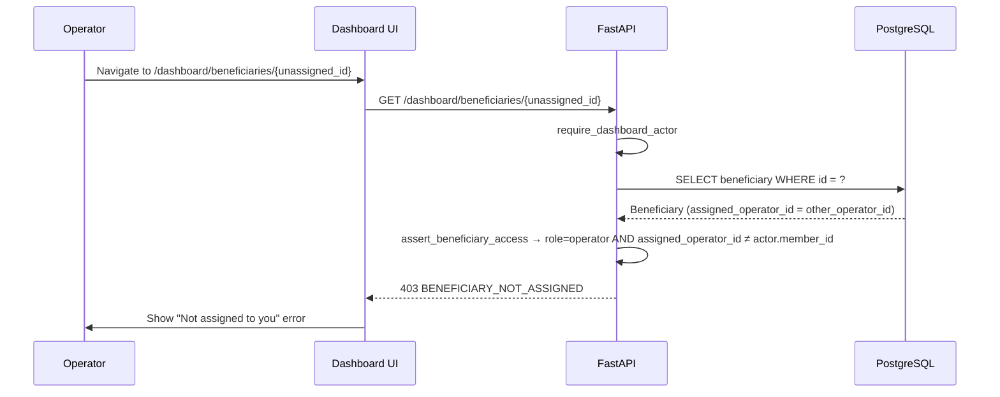

# Operator Beneficiary Management

How operators create, view, update, and manage beneficiary records in the dashboard.

---

## Overview

Operators are assigned to specific beneficiaries. They can:
- View only their assigned beneficiaries
- Create new beneficiary records
- Add notes and schedule follow-ups
- Update application status
- Run eligibility checks

---

## Create Beneficiary

`POST /dashboard/beneficiaries`

```json
{
  "name": "Sunita Devi",
  "phone_e164": "+919876543210",
  "state_code": "OD",
  "language_code": "or",
  "gender": "female",
  "date_of_birth": "1974-03-15",
  "caste": "SC",
  "annual_income_inr": 48000,
  "bpl_card": true,
  "assigned_operator_id": "<operator_member_id>"
}
```

Creates a `Beneficiary` row scoped to the actor's `organisation_id`. If `assigned_operator_id` is not provided, the creating operator is automatically assigned.

An `AuditLog` entry is written for the create action.

---

## List and Search Beneficiaries

`GET /dashboard/beneficiaries`

| Filter | Type | Operator Access |
|---|---|---|
| `q` | Text search | Yes |
| `state_code` | String | Yes |
| `status` | Application status | Yes |
| `followup_due` | ISO date | Yes |
| `assigned_operator_id` | UUID | Admin only |

Operators see only their assigned beneficiaries. Admins see all in their organisation.

---

## View Beneficiary Detail

`GET /dashboard/beneficiaries/{beneficiary_id}`

Returns full detail:
- Beneficiary profile fields
- All notes (most recent first)
- All follow-ups (sorted by due date)
- Scheme assignments with application status
- `assigned_operator_id`

**Access check**: `assert_beneficiary_access(actor, beneficiary_org_id, assigned_operator_id)`:
- Super admin → always allowed
- NGO admin → allowed if same organisation
- Operator → allowed only if `assigned_operator_id == actor.member_id`

---

## Update Beneficiary

`PATCH /dashboard/beneficiaries/{beneficiary_id}`

Partial update — only provided fields are changed. Triggers an `AuditLog` entry.

---

## Add Note

`POST /dashboard/beneficiaries/{beneficiary_id}/notes`

```json
{"note": "Beneficiary visited CSC. Collected income certificate."}
```

Creates a `BeneficiaryNote` row with `actor_member_id` and timestamp.

---

## Add Follow-up

`POST /dashboard/beneficiaries/{beneficiary_id}/followups`

```json
{
  "due_date": "2026-06-01",
  "note": "Call to remind about application submission",
  "followup_type": "call"
}
```

Creates a `BeneficiaryFollowup` row. The operator receives a notification when the due date is approaching.

---

## Update Follow-up

`PATCH /dashboard/followups/{followup_id}`

```json
{"completed_at": "2026-05-28T11:00:00Z", "resolution_note": "Beneficiary confirmed submission."}
```

---

## Run Eligibility (Dashboard)

`POST /dashboard/beneficiaries/{beneficiary_id}/eligibility`

**Current status**: Partial — endpoint exists and rate-limits correctly, but returns empty results. Real eligibility engine integration from dashboard is pending.

---

## Sequence Diagram — Operator Creates Beneficiary



---

## Sequence Diagram — Operator Denied for Unassigned Beneficiary



---

## Tests

| Test | Coverage |
|---|---|
| `tests/unit/test_phase5_rbac.py` | Operator denial, NGO admin org scope, super admin access |
| `frontend/tests/e2e/operator-dashboard.spec.ts` | Full E2E: create, list, detail, notes, follow-ups, denial |
