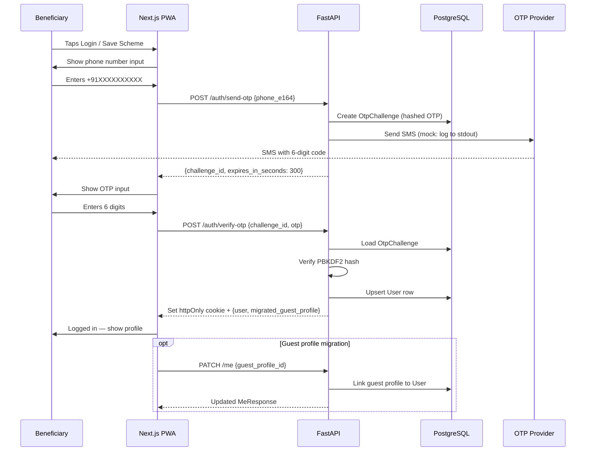

# OTP Login Workflow

Phone OTP authentication for beneficiaries using the AdhikarAI PWA.

---

## Step-by-Step Narrative

### Step 1 — Trigger Login

The beneficiary taps "Login" or tries to save a scheme (which requires auth). The OTP modal appears.

### Step 2 — Enter Phone Number

The beneficiary enters their phone number in Indian format (e.g., `9876543210`). The PWA formats it to E.164 (`+919876543210`).

### Step 3 — Send OTP

`POST /auth/send-otp`

```json
{"phone_e164": "+919876543210"}
```

The backend:
1. Validates the phone number format.
2. Checks OTP retry cooldown (`OTP_RETRY_AFTER_SECONDS` = 30s).
3. Generates a 6-digit OTP with `secrets.randbelow(1_000_000)`.
4. Computes `hash_otp(otp, challenge_id)` using PBKDF2-SHA256.
5. Stores an `OtpChallenge` row with the hashed OTP and expiry.
6. Calls the OTP provider (`mock` locally; `msg91` in production).
7. Returns `{challenge_id, expires_in_seconds}`.

With mock provider: OTP is printed to server stdout. Not sent via SMS.

### Step 4 — Enter OTP

The beneficiary receives the SMS (or reads it from the server log in dev mode) and enters the 6-digit code.

### Step 5 — Verify OTP

`POST /auth/verify-otp`

```json
{"challenge_id": "<uuid>", "otp": "123456"}
```

The backend:
1. Loads the `OtpChallenge` row.
2. Checks it hasn't expired (`OTP_EXPIRY_SECONDS` = 5min).
3. Checks attempt count ≤ `OTP_MAX_ATTEMPTS` (5).
4. Computes `hash_otp(otp, challenge_id)` and compares with stored hash using `hmac.compare_digest`.
5. On match: upserts a `User` row for the phone number.
6. Creates a JWT with `{sub: user_id, org: public_org_id, iat, exp}`.
7. Sets the JWT as an httpOnly cookie (`adhikarai_session`).
8. Returns `{user: {...}, migrated_guest_profile: true/false}`.

### Step 6 — Guest Profile Migration (Optional)

If the beneficiary had a guest profile (pre-login), the JWT-cookie-authenticated `PATCH /me` is called with `guest_profile_id` to migrate the guest profile to the now-authenticated user.

---

## Sequence Diagram



---

## Error Paths

| Scenario | HTTP | Code | User Message |
|---|---|---|---|
| OTP still cooling down | 429 | `OTP_RATE_LIMITED` | Wait 30 seconds before requesting another OTP |
| OTP challenge not found | 404 | `OTP_CHALLENGE_NOT_FOUND` | Please request a new OTP |
| OTP expired | 400 | `OTP_EXPIRED` | OTP has expired. Please request a new one |
| Wrong OTP | 401 | `OTP_INVALID` | OTP is incorrect. Please try again |
| Too many attempts | 429 | `OTP_MAX_ATTEMPTS_EXCEEDED` | Too many attempts. Please request a new OTP |
| Invalid phone format | 422 | `INVALID_REQUEST` | Please enter a valid Indian phone number |

---

## Data Written

| Model | When |
|---|---|
| `OtpChallenge` | On `send-otp`: created with hashed OTP |
| `User` | On `verify-otp` success: upserted (created or fetched) |
| `Profile` (linked) | On guest migration: linked to User |

---

## Tests

| Test | Coverage |
|---|---|
| `tests/unit/test_phase4_security.py` | OTP hash generation, cookie setting, no JWT in localStorage |
| `tests/integration/test_phase4_routes.py` | `/auth/send-otp` and `/auth/verify-otp` route behaviour |
