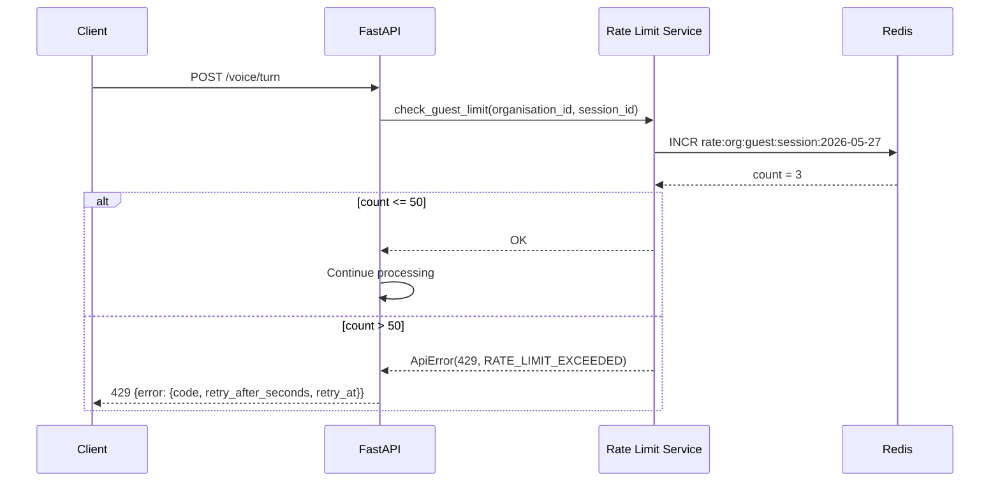

# Rate Limiting Workflow

How AdhikarAI enforces daily usage limits per actor using Redis counters.

---

## Design

Rate limits are per-actor, per-organisation, per-day (UTC). Counters reset at midnight UTC. The implementation uses Redis `INCR` for atomic incrementing.

---

## Actor Types

| Actor | Limit | Redis Key Pattern |
|---|---|---|
| Guest (unauthenticated beneficiary) | 50/day | `rate:{org_id}:guest:{session_id}:{YYYY-MM-DD}` |
| Authenticated user | 100/day | `rate:{org_id}:user:{user_id}:{YYYY-MM-DD}` |
| Dashboard operator | 1000/day | `rate:{org_id}:operator:{member_id}:{YYYY-MM-DD}` |

All defaults are configurable via environment variables:
- `RATE_LIMIT_GUEST_PER_DAY`
- `RATE_LIMIT_USER_PER_DAY`
- `RATE_LIMIT_OPERATOR_PER_DAY`

---

## Algorithm

```python
key = f"rate:{organisation_id}:{actor_type}:{actor_id}:{date.today()}"
count = INCR key
if count == 1:
    EXPIRE key, seconds_until_next_midnight()
if count > limit:
    raise ApiError(429, "RATE_LIMIT_EXCEEDED", {...})
```

The `INCR` + `EXPIRE` pattern ensures atomic counting with automatic daily cleanup.

---

## Where Rate Limits Are Applied

| Endpoint | Actor Type | Called By |
|---|---|---|
| `POST /voice/turn` | guest (by session_id) | `voice.py:check_guest_limit` |
| `POST /dashboard/beneficiaries/{id}/eligibility` | operator | `dashboard.py:check_operator_limit` |
| `POST /dashboard/bulk-eligibility` | operator (units = row count) | `dashboard.py:check_operator_limit` |

---

## Sequence Diagram



---

## Error Response

```json
{
  "error": {
    "code": "RATE_LIMIT_EXCEEDED",
    "message": "You have used today's limit. Please try tomorrow or visit a CSC.",
    "retry_after_seconds": 43200,
    "retry_at": "2026-05-28T00:00:00+00:00"
  }
}
```

---

## Memory Fallback

When `REDIS_URL=memory://`, rate limits are tracked in an in-process `defaultdict`. This:
- Works correctly for single-worker local development
- Does **not** persist across server restarts
- Does **not** share state across workers (multi-process or multi-host deployments)

In staging/production, a real Redis URL is required. The config validator rejects `memory://` in deployed environments.

---

## Bulk Eligibility Rate Limiting

For bulk CSV uploads, `check_operator_limit` is called once per CSV row. A file with 100 rows costs 100 units of the operator's daily limit.

```python
await check_operator_limit(actor.organisation_id, actor.member_id, units=len(rows))
```

---

## Tests

| Test | Coverage |
|---|---|
| `tests/unit/test_phase5_rate_limit.py` | Counter increment, key format includes org/actor/date, expiry, 429 error, memory fallback |
