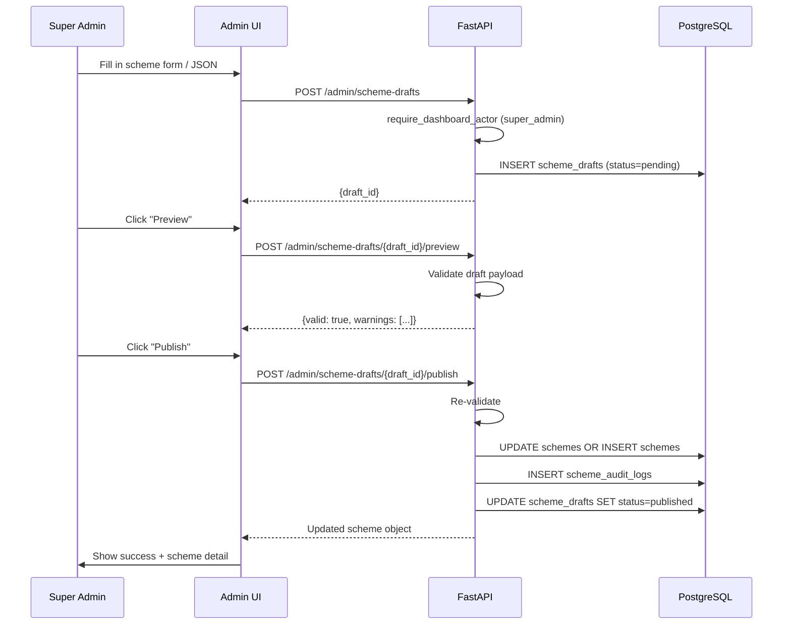
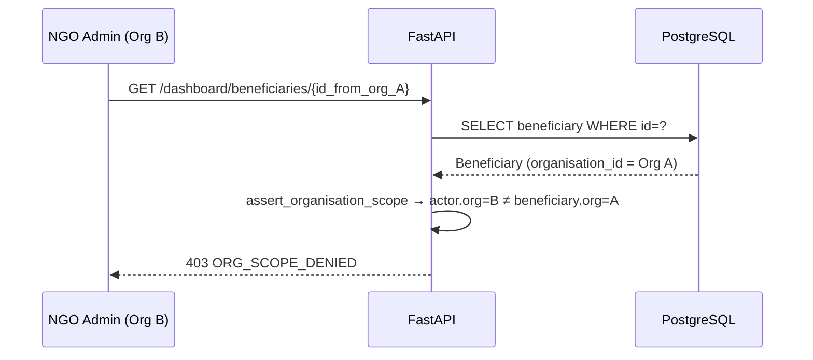

# Scheme Admin Draft-Publish Flow

How a super admin creates, previews, and publishes a welfare scheme using the admin panel.

---

## Overview

Scheme management follows a draft → preview → publish lifecycle. Changes are tracked in `scheme_drafts` and `scheme_audit_logs`. This ensures no untested change goes live directly.

---

## Step-by-Step

### Step 1 — Create Draft

`POST /admin/scheme-drafts`

```json
{
  "draft_payload": {
    "id": "widow-pension-od",
    "name": "Widow Pension Scheme (Odisha)",
    "description": "Monthly pension for widows aged 40-79 in Odisha",
    "benefit_type": "cash",
    "benefit_amount_inr": 500,
    "state_code": "OD",
    "category_code": "pension",
    "eligibility_rules": {
      "criteria": [
        {"field": "gender", "op": "eq", "value": "female"},
        {"field": "marital_status", "op": "eq", "value": "widow"},
        {"field": "age", "op": "gte", "value": 40},
        {"field": "age", "op": "lte", "value": 79},
        {"field": "state_code", "op": "eq", "value": "OD"}
      ],
      "documents": [
        {"name": "Death Certificate of Husband", "required": true, "substitutes": []},
        {"name": "Aadhaar Card", "required": true, "substitutes": ["Voter ID", "Ration Card"]}
      ]
    }
  },
  "change_summary": "Initial creation of Odisha widow pension scheme"
}
```

Creates a `SchemeDraft` row with `status="pending"`. If editing an existing scheme, link via `scheme_id` in the payload.

### Step 2 — Preview Draft

`POST /admin/scheme-drafts/{draft_id}/preview`

Validates the draft:
- Checks rule JSON schema (all required fields, valid operators)
- Validates document list (required field, valid substitutes)
- Returns the draft payload with a validation summary (no changes to DB)

### Step 3 — Publish Draft

`POST /admin/scheme-drafts/{draft_id}/publish`

1. Re-validates the draft payload.
2. If scheme exists (`scheme_id` in draft):
   - Updates the `Scheme` row fields.
   - Creates a `SchemeAuditLog` entry with `change_summary` and actor.
3. If new scheme:
   - Creates the `Scheme` row.
   - Creates the `EligibilityRule` row.
   - Sets initial status to `draft`.
   - The scheme requires a separate publish action to make it live.
4. Updates `SchemeDraft.status = "published"`.
5. Returns the updated scheme.

---

## Sequence Diagram



---

## NGO Admin Cross-Org Denial



---

## Related Tables

| Table | Purpose |
|---|---|
| `scheme_drafts` | Draft versions pending review |
| `schemes` | Published active scheme records |
| `eligibility_rules` | Rule criteria per scheme |
| `scheme_audit_logs` | Change history for schemes |
| `scheme_status_events` | Status transition log |

---

## Known Limitations

- Scheme history (`GET /admin/schemes/{id}/history`) returns an empty list — query not implemented.
- No frontend scheme editor with field-by-field form inputs; admin must supply raw JSON in the `draft_payload`.
- Newly created schemes via draft/publish require a separate admin publish step to move from `draft` to `published` status.

---

## Tests

| Test | Coverage |
|---|---|
| `tests/unit/test_phase5_scheme_drafts.py` | Draft creation, validation, publish |
| Local E2E | `POST /admin/scheme-drafts` and preview via local E2E report |
