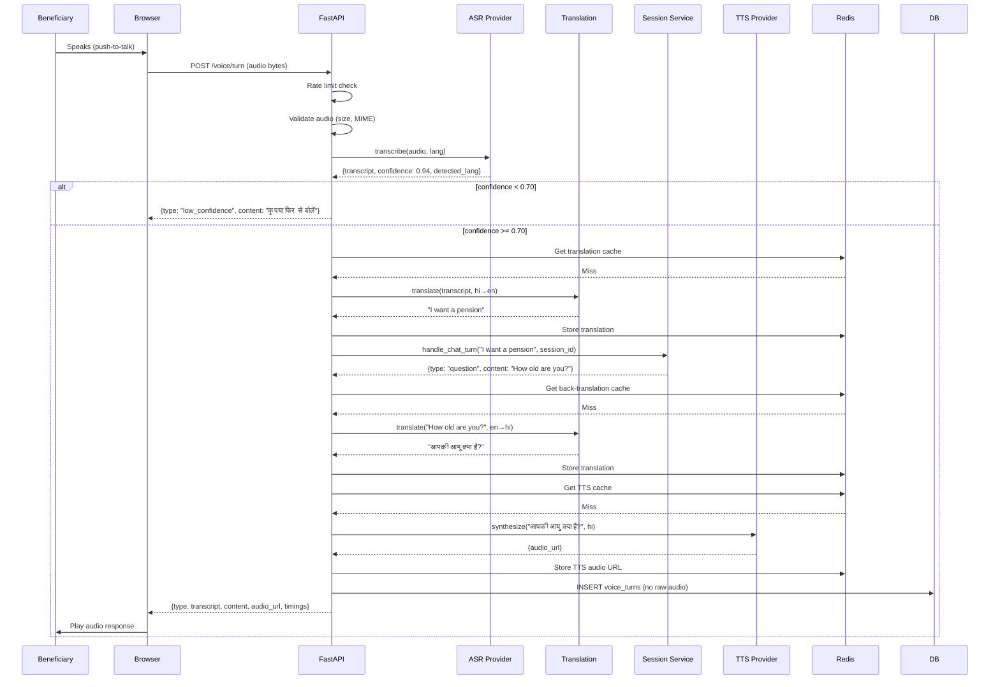

# Voice Turn Workflow

The end-to-end flow for a single voice turn: from microphone capture to agent response audio.

---

## Overview

A voice turn is one complete round trip:
1. Beneficiary speaks
2. ASR transcribes audio
3. Translation converts to English (if non-English)
4. Agent processes English text
5. Translation converts response back to user language
6. TTS synthesizes audio
7. PWA plays response audio

---

## Step-by-Step

### Step 1 — Record Audio

The beneficiary presses the mic button. `AudioRecorder.tsx` starts `MediaRecorder` and streams WebM/Opus audio. Silence detection stops recording after 1.5 seconds of silence (below threshold).

### Step 2 — Upload Audio

`POST /voice/turn` (multipart form data):
- `organisation_id`: UUID
- `session_id`: Conversation session ID
- `selected_language_code`: e.g. `hi`, `or`, `ta`
- `audio`: Binary audio file (WebM/Opus, max 8 MB)
- `client_duration_ms`: Optional client-reported duration

### Step 3 — Rate Limit Check

The backend checks the guest rate limit via `check_guest_limit(organisation_id, session_id)`. If exceeded, returns `429 RATE_LIMIT_EXCEEDED`.

### Step 4 — Audio Validation

`app/voice/audio_utils.py:validate_audio_upload`:
- File size ≤ `VOICE_MAX_UPLOAD_MB` (8 MB)
- Content-type is an accepted audio MIME type

### Step 5 — ASR Transcription

`asr_provider.transcribe(audio_bytes, mime_type, language_code)` → `AsrResponseModel`:
- `transcript`: Raw text from ASR
- `confidence`: 0.0–1.0
- `detected_language_code`: Language detected
- `provider`: Which ASR provider was used

### Step 6 — Confidence Gate

If `confidence < ASR_MIN_CONFIDENCE` (0.70):
- Skip translation and agent.
- Persist `VoiceTurn` with `status="low_confidence"`.
- Return `{type: "low_confidence", content: localized_retry_message}`.

### Step 7 — Translation to English

If `selected_language_code != "en"`:
- `translator.translate(transcript, source=selected_language, target="en")`
- Check Redis cache first; call provider if miss.
- Cache result with 7-day TTL.

### Step 8 — Agent Turn

`handle_chat_turn(ChatInputModel{message: english_text, language_code, session_id, organisation_id}, db)`

Returns `ChatOutputModel{type, content, payload, profile_completeness}`.

### Step 9 — Back-Translation

If `selected_language_code != "en"`:
- Translate agent `content` back to user language.
- Cache with 7-day TTL.

### Step 10 — TTS Synthesis

`tts.synthesize_to_url(TtsRequestModel{text: localized_content, language_code})`:
- Check Redis cache first.
- Call provider if miss.
- Return `{audio_url}`.

### Step 11 — Persist VoiceTurn

Insert `VoiceTurn` row with all metadata (no raw audio). Commit.

### Step 12 — Return Response

```json
{
  "type": "question",
  "transcript": "मुझे पेंशन चाहिए",
  "detected_language_code": "hi",
  "selected_language_code": "hi",
  "confidence": 0.94,
  "content": "आपकी आयु क्या है?",
  "audio_url": "/voice/audio/abc.mp3",
  "profile_completeness": 28,
  "timings": {
    "asr_ms": 820,
    "translation_to_en_ms": 110,
    "agent_ms": 1150,
    "translation_from_en_ms": 98,
    "tts_ms": 490,
    "total_ms": 2668
  }
}
```

---

## Sequence Diagram



---

## Error Paths

| Scenario | Response |
|---|---|
| Audio too large | 413 `AUDIO_TOO_LARGE` |
| Unsupported MIME type | 415 `AUDIO_MIME_UNSUPPORTED` |
| ASR confidence too low | 200 `{type: "low_confidence"}` (not an error) |
| ASR provider timeout | 504 `ASR_TIMEOUT` |
| Agent timeout | 504 `AGENT_TIMEOUT` |
| Rate limit exceeded | 429 `RATE_LIMIT_EXCEEDED` |

---

## Tests

| Test | Coverage |
|---|---|
| `tests/unit/test_phase3_audio_validation.py` | Size and MIME validation |
| `tests/unit/test_phase3_voice_pipeline.py` | Full pipeline with mocked ASR/translate/TTS |
| `tests/unit/test_phase3_language_and_cache.py` | Translation caching logic |
| `tests/integration/test_phase3_voice_routes.py` | `/voice/turn` and `/voice/asr` endpoints |
